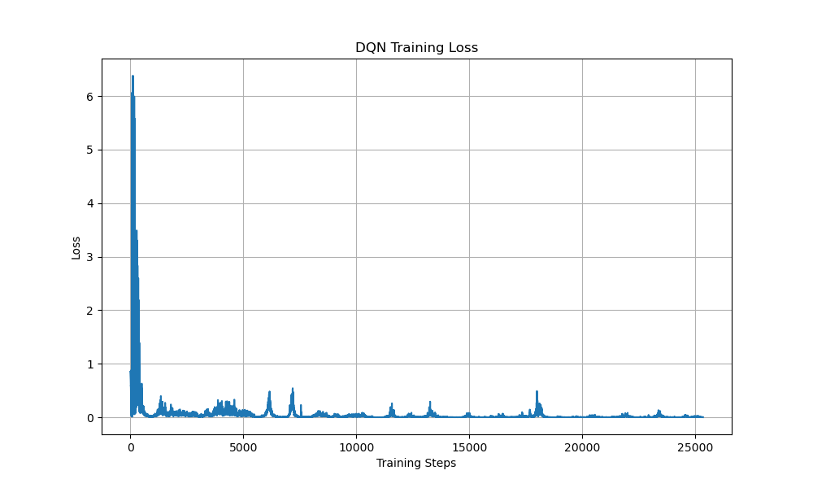
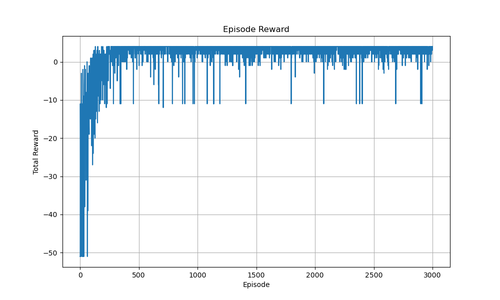
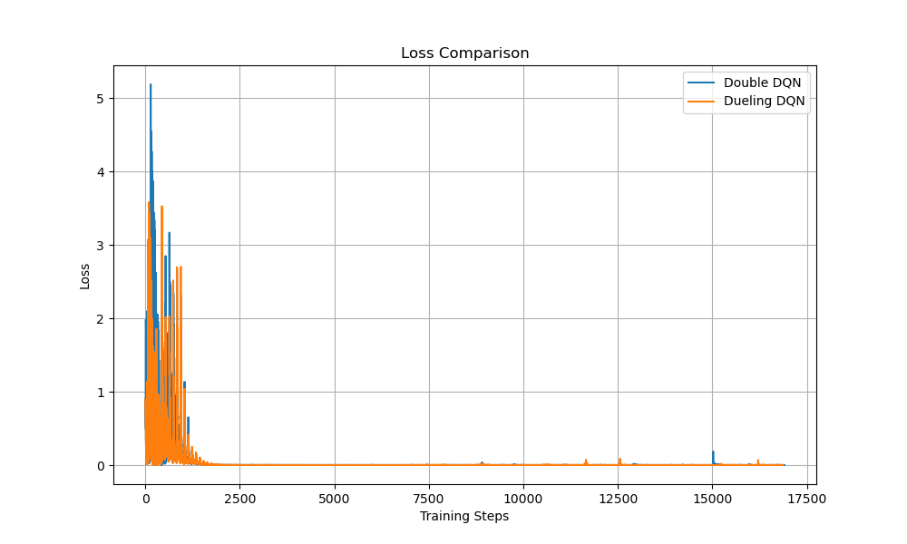
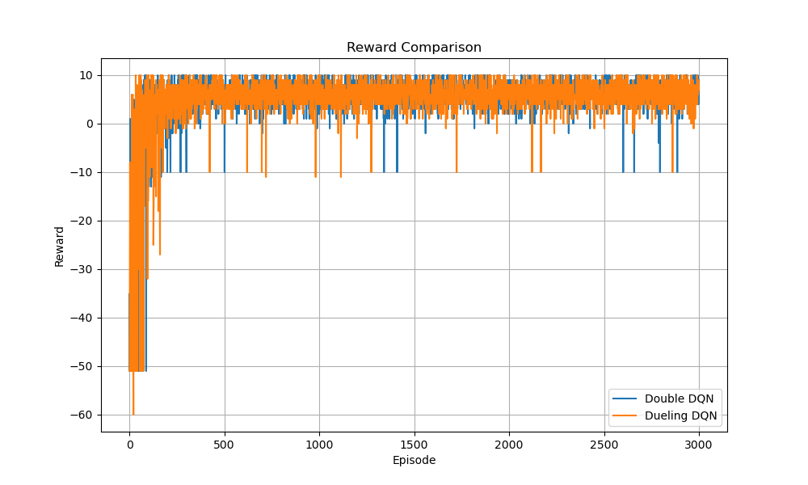
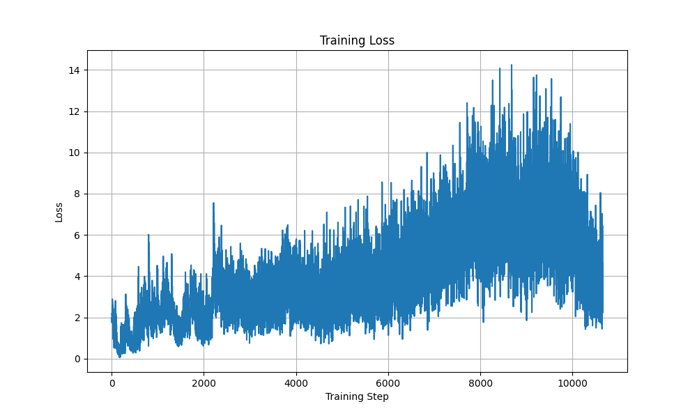
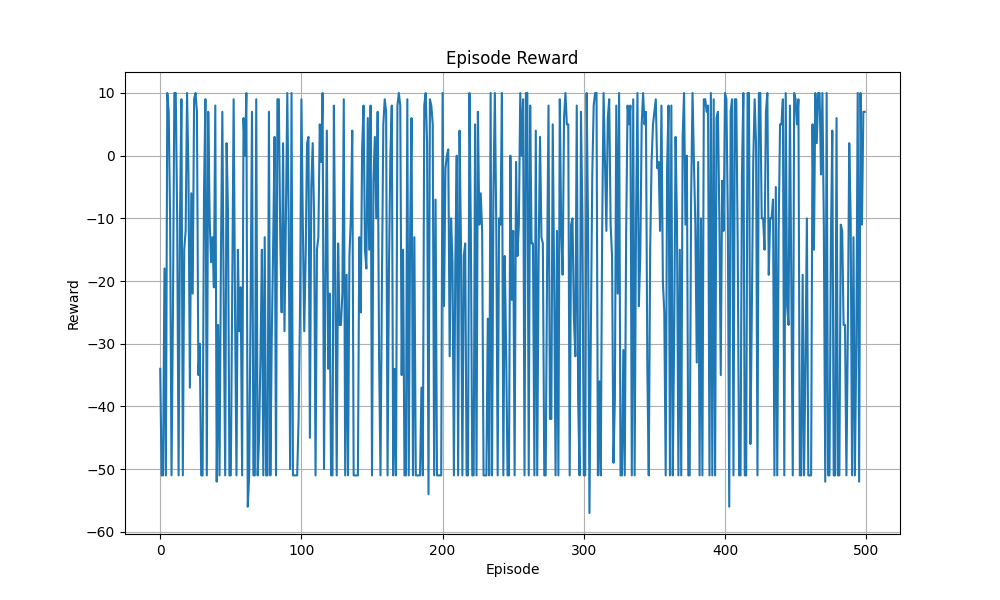
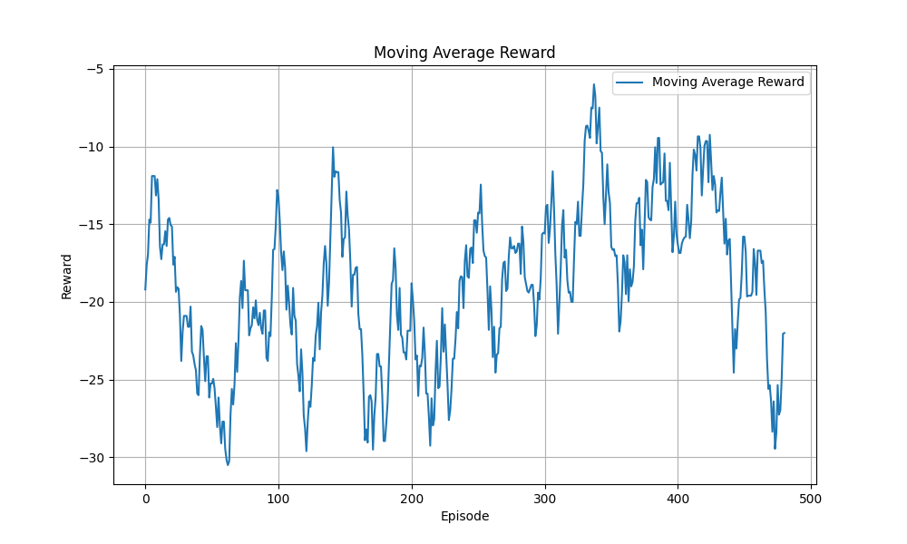
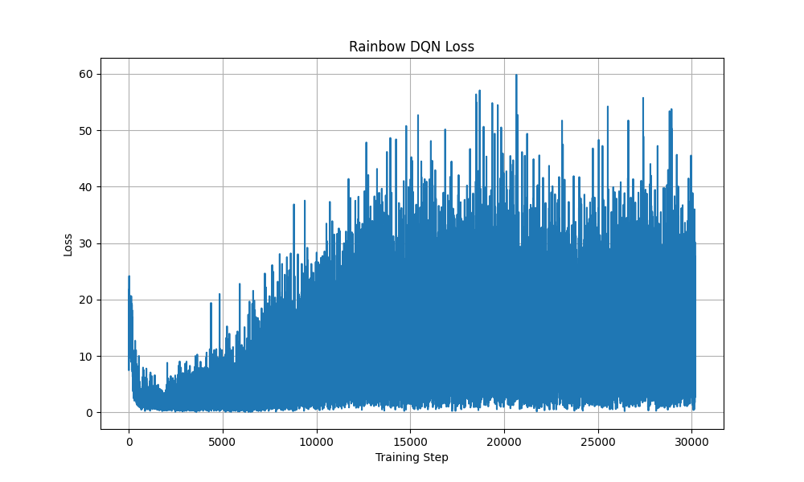
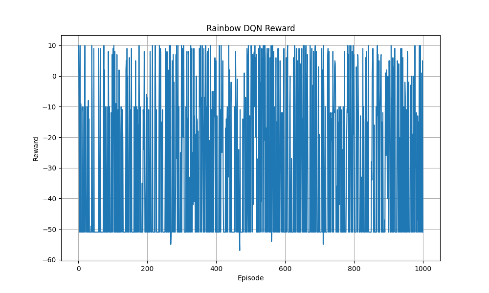

# 深度強化學習 HW3 專案
## DQN / Double DQN / Dueling DQN / Rainbow DQN

本專案為深度強化學習（Deep Reinforcement Learning）作業實作，使用 PyTorch 與 PyTorch Lightning 建立多種 DQN 演算法，並於 GridWorld 環境中進行訓練與測試。

---

# 專案內容

本專案包含以下內容：

| 作業 | 主題 | 環境 |
|---|---|---|
| HW3-1 | Naive DQN + Experience Replay | Static Mode |
| HW3-2 | Double DQN + Dueling DQN | Player Mode |
| HW3-3 | Enhanced DQN (Lightning) | Random Mode |
| HW3-4 | Rainbow DQN | Random Mode |

---

# 專案架構

```bash
HW3/
│
├── HW3-1.py
├── HW3-2.py
├── HW3-3.py
├── HW3-4.py
│
├── Gridworld.py
│
├── HW3-1_output/
├── HW3-2_output/
├── HW3-3_output/
├── HW3-4_output/
│
├──HW3_chat_log.pdf
├──報告HW3-1.md
├──報告HW3-2.md
├──報告HW3-3.md
├── 報告HW3-4.md
│
└── README.md

```

---

# 環境需求

## Python Version

```bash
Python 3.10+
```

---

# 安裝套件

```bash
pip install torch
pip install torchvision
pip install matplotlib
pip install numpy
pip install pytorch-lightning
```

---

# GridWorld 環境介紹

本專案使用 4x4 GridWorld 作為強化學習環境。

## 地圖元素

| 符號 | 意義 |
|---|---|
| P | Player |
| + | Goal |
| - | Pit |
| W | Wall |

---

# Reward 設計

| 條件 | Reward |
|---|---|
| 到達 Goal | +10 |
| 掉入 Pit | -10 |
| 一般移動 | -1 |

---

# HW3-1 Naive DQN

## 功能

- 基本 DQN
- Experience Replay
- Epsilon-Greedy
- Static Mode

---

## DQN 架構

```python
64 → 150 → 100 → 4
```

---

## Experience Replay

使用 Replay Buffer 儲存：

```python
(state, action, reward, next_state, done)
```

訓練時隨機抽樣：

```python
random.sample(replay, batch_size)
```

優點：

- 打破資料相關性
- 增加訓練穩定性
- 提升收斂效果

---

# HW3-1 結果

## Training Loss



---

## Reward Curve



---

# HW3-2 Enhanced DQN

## 功能

- Double DQN
- Dueling DQN
- Target Network
- Experience Replay
- Player Mode

---

# Double DQN

## 問題

傳統 DQN 容易：

- Q-value 高估
- 訓練不穩定

---

## 解法

Double DQN：

### Online Network
負責：

```python
argmax(Q)
```

### Target Network
負責：

```python
Q_target
```

---

## Double DQN 更新公式

```math
Q(s,a)=r+\gamma Q_{target}(s',\arg\max_a Q_{online}(s',a))
```

---

# Dueling DQN

## 核心概念

將 Q-value 分解：

- State Value
- Advantage

---

## Dueling 結構

```math
Q(s,a)=V(s)+\left(A(s,a)-\frac{1}{|A|}\sum_{a'}A(s,a')\right)
```

---

## 優點

- 更有效學習 State 價值
- 提升策略穩定性
- 強化訓練效率

---

# HW3-2 結果

## Loss Comparison



---

## Reward Comparison



---

# HW3-3 Enhanced DQN with PyTorch Lightning

## 功能

- PyTorch Lightning
- Double DQN
- Target Network
- Gradient Clipping
- Learning Rate Scheduler
- Random Mode

---

# PyTorch Lightning

優點：

- 程式碼模組化
- 更容易管理訓練流程
- 自動處理訓練 Loop
- 提升可讀性

---

# Gradient Clipping

避免：

- Gradient Explosion
- Loss 發散

---

## Gradient Clipping

```math
||g|| \leq 1.0
```

---

# Learning Rate Scheduler

使用：

```python
ExponentialLR
```

目的：

- 後期降低學習率
- 提升收斂穩定性

---

# HW3-3 結果

## Loss Curve



---

## Reward Curve



---

## Moving Average Reward



---

# HW3-4 Rainbow DQN

## Rainbow DQN 整合技術

| 技術 | 功能 |
|---|---|
| Double DQN | 降低 Q-value 高估 |
| Dueling DQN | 分離 Value 與 Advantage |
| PER | 重要樣本優先學習 |
| Multi-Step Learning | 加速 Reward 傳播 |
| Noisy Network | 自動探索 |
| Target Network | 穩定訓練 |
| Gradient Clipping | 防止梯度爆炸 |
| LR Scheduler | 動態調整學習率 |

---

# Prioritized Experience Replay

## 核心概念

TD Error 越大：

- 越值得學習
- 被抽樣機率越高

---

## PER 公式

```math
P(i)=\frac{p_i^{\alpha}}{\sum_k p_k^{\alpha}}
```

---

# Multi-Step Learning

## 傳統 DQN

只看一步 Reward。

---

## Multi-Step

累積多步 Reward：

```math
R_t=\sum_{k=0}^{n-1}\gamma^k r_{t+k}
```

---

# Noisy Network

使用可學習 Noise：

- 取代 epsilon-greedy
- 增加探索能力

---

# HW3-4 結果

## Rainbow DQN Loss



---

## Rainbow DQN Reward



---

# 實驗比較

| 方法 | 穩定性 | 收斂速度 | 表現 |
|---|---|---|---|
| Naive DQN | 普通 | 慢 | 基礎 |
| Double DQN | 較穩定 | 中等 | 良好 |
| Dueling DQN | 穩定 | 快 | 更佳 |
| Enhanced DQN | 很穩定 | 快 | 優秀 |
| Rainbow DQN | 最穩定 | 最快 | 最佳 |

---

# 心得

透過本次作業，我實作了多種 DQN 演算法，並深入理解：

- Experience Replay
- Target Network
- Double DQN
- Dueling DQN
- Rainbow DQN

也學習到：

- 如何提升 RL 訓練穩定性
- 如何改善 Q-value 高估問題
- 如何利用多種技巧提升學習效率

Rainbow DQN 結合多種強化學習技巧後，在 Random Mode GridWorld 中有最穩定的表現與最高勝率。

---

# 參考資料

## DRL in Action GitHub

https://github.com/DeepReinforcementLearning/DeepReinforcementLearningInAction

---

